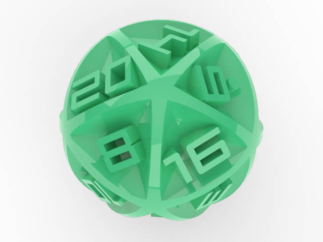
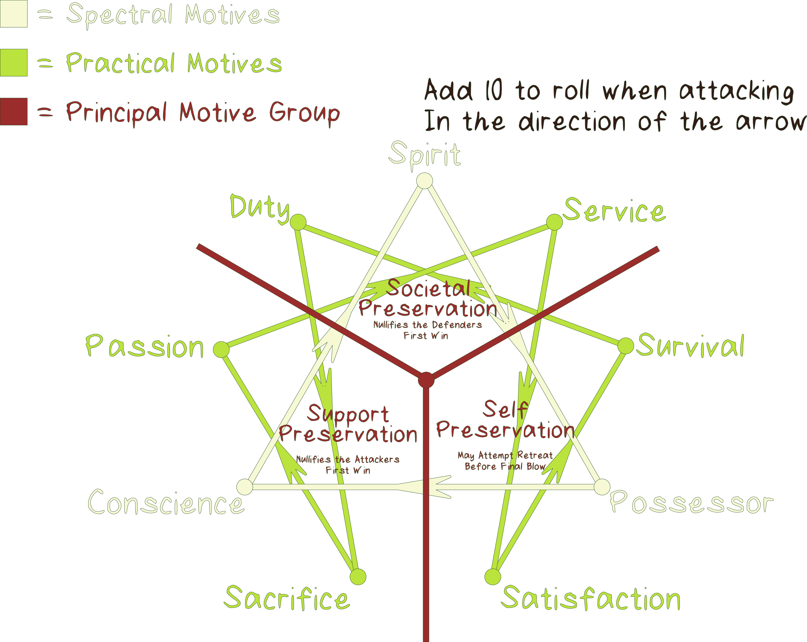

## Welcome to the Kipuka! {#overview}

***I am glad you are here* and want to play by the rules.** We have put a lot of time into organizing our rules to make viewing pleasurable on a variety of devices and still look good on paper.
  
**Warnings before play:** 
Kipukas uses many small game pieces to keep track of play. All pieces should be treated as **CHOKING HAZARDS and the game content is for people 13+ years of age.** Do not let children under or pets play with the pieces. At all times, it is the responsibility of the legal guardians to keep all pieces out of reach of children and pets.

The included chat bot (Kippa) is an **alpha** feature to assist players in learning the rules. Kippa can hallucinate — the rules text is always the canonical source. Interactions may be anonymously logged for debugging and improvement; no personal or identifying data is ever collected. For the full list of limitations see [Using the Binder](/using_the_binder#kippa).
  
By continuing to play with our products, you acknowledge that Kipukas accepts no liability for damages incurred by the misuse of our products.

## Game Forward (You may skip if you prefer) {#forward}

Kipukas is a game which draws the best concepts from creature card games and melds them with land conquering play. While I have personally enjoyed playing in other competitive card based games, I grew frustrated with becoming attached to certain characters, styles, and strategies only to have them become re-released, competitively invalidated by the latest deck release, or banned due to corporate oversight. On top of this, game companies tend to produce very poor quality cards which are not meant to last, yet some manage to reach unfathomable prices not worthy of the underlying paper. Kipukas seeks to be different. I want Kipukas, both as a game and a durable good, to outlast myself. By making cards which are updatable without new releases, we keep all the cards we produce competitively relevant. Additionally, with most cards produced at low rates, Kipukas challengers are much more diverse. The durability of our cards as game pieces are protected by the fact that we can update a broken card mechanic POST SALE. This protects your value from being wasted due to our short sightedness or oversight. While most land conquering games are enjoyable as well as strategically challenging, I was dissatisfied with the amount of pure luck the games hinge on. By combining with the complex card v. card mechanics, Kipukas battles feel more engaging, all the while retaining the larger scale strategies of the land conquering play. While complex and entertaining play is great, I want Kipukas to take on deep meaning and help spread it to many wonderful people in this world. Kipukas will set industry standards for innovative play, company interaction, and support of all whom make Kipukas awesome. Lastly, I hope many find Kipukas as enjoyable as I have found my competition. Better yet, more so.

## Background (You may skip if you prefer){#background}

Kipukas is a visualization of a world where society creates new worlds as they see fit. Each of these worlds are known as kipuka, which comes from the Hawaiian word for 'land between lava flows', and is symbolic of the destruction and rebirth of worlds. Cloning and genetic manipulation are the preferred methods of populating, expanding, and manipulating the worlds. In the game, the kipukas are represented by the 3D game map and the souls take life in the cards. The game represents the strife to control the world, while the players provide the motivation for the strife. The companion book series, Conscious Territory, which takes a deep dive into these concepts, is in progress with the first three chapters released and ready for reading. I have personally enjoyed working the concepts and hope you will enjoy contemplating them as well.

## Objective: Conquer {#win}

### Winning the game

Get off to a good start and establish base camps across the board. Win fights and think strategically to take your frenemies base camps and if you dare their capital! Once one player claims all base camps and capitals, they dominate the kipuka and win the game.

## Required Game Pieces {#pieces}

Let's go over the pieces for a 2 player game

These are **ALMOST** all provided in the starter kit for 2 players

**Personal Player Devices**
Practically any Android or Apple Phone, or laptop computer will work with our game. If you want to use our QR codes (highly recommended) it will need a camera (ideally front-facing). This one is up to you to provide; we are not Oprah.

**Token Sets (Per Player)**
Set includes 10 Soul tokens, 11 Base Camp tokens, and a Capital token

**Capital (left or top):** The hardest area to take 
**Base Camp (center):** The standard base of operations
**Soul Token (right or bottom):** Reveals a soul's position on the map

<!-- pagebreak -->

**Dice Sets (Per Player)**
Set includes 2 six sided dice, a 20 sided die, and a Diel Die

**D6 (left or top):** A die with 6 faces
**Diel Die (center)** Controls the day, night and storm cycle
**D20 (right or bottom):** A die with more faces!

**[3D Kipuka Map](#maps)**
This is the field of play where the souls move, battle, and claim 

**[Field Mat](#mats)**
This organizes the play by keeping track of which cards are in which territory

**[Card Decks](#building_decks)**
One deck per player. Both must be built with 30 cards and should meet the criteria listed at Building Decks.

**initiative Token**
The player whom holds this token holds the power to play first next round.

**Phone Stands**
These make scanning the QR codes nice and easy

**Game Rules**
You are [here](#overview). These are avaliable on the card binder, kipukas.cards, for your digital viewing or printing pleasuring.

**Mini Dry Erase Boards (and Pens)**
These are for used for aspects of attack and defense

**Friend**
We can’t provide this one. We measured, they don’t fit in the box.  
Even if we succeeded, “Friend” would be a strong word.

## Familiarizing Game Play Concepts {#conventions}

**Our Conventions, Courtesy, and Quarks**

### Pieces {#ccq_pieces}

Kipukas relies on oversized cards, 3d printed game pieces and game boards, and a mat for play organization. We currently make all of these as a batch process in-house. The cards we produce do not include the play mechanics on the card as, to my knowledge, all other card companies do. Instead, we let the artist’s work be as big and beautiful as possible. In fact, we do not even let the name of the card get in the way of showcasing artistic talent. Instead, we have made the play data for every card we produce accessible from the QR code printed on each card's back. Technically, this means the back of every kipukas card is wholy unique and identifible. However, unless you can scan a QR code with your eye it probally won’t help you much. Additionally, the card art on the back helps camouflage the QR from cameras at a distance making remote cheating quite difficult to say the least.

### Example Card {#example_card}

 

**Front and back of a the Kipukas card ”Hilbert: King of Avian Frogs” (above)**. Creating a card boarder was the artist's choice.

### QR Codes {#qr}

Each card has a unique QR code on its back. Scan it with the **QR scanner** in the toolbar on kipukas.cards to view that card's play data. The scanner runs entirely on your device — the camera feed is never stored or transmitted. For step-by-step instructions, screenshots, and alternative app recommendations see [Using the Binder](/using_the_binder#qr-scanner).

### Design {#design}

A last note about the cards. The center of the edge on the cards is colored to reflect their archetypal adaptation. This is a unique feature that allows players to see what type of card is on its way. Take advantage!

The following image shows an example of our game board, a.k.a. the map or kipuka. For your convenience, it is labeled with token placement and boundary line nomenclature.

 

Note the numbers on each territory stand. This is the reference for that territory. The following is an example of a mat that would be paired with the above map.

The slot numbers reference the territory numbers on the board. When cards are played, they are played on these slots. Once a soul token moves between territories, their corresponding card is moved from the old territory slot to the new territory slot on the mat.

### Game Terminology {#terms}

-   A turn in Kipukas refers to a single day, night or storm (diel cycle) roll. Turns are shared between the players.
-   An action refers to inacting a play rule. You can take as many actions (playing cards, moving souls, etc.) as possible during a diel cycle, but this consists of only one turn.
-   A player with initiative takes the first action in a turn. Once an action is taken, the next player takes an action. This passes back an forth until either player takes initiative for the next turn.
-   Characters and Species are collectively called souls. While they have subtle play differences, when the term soul is used they play in the same manner for that context.
-   Kipuka (singular) refers to the 3D terrain that the game is played on.

## Game Setup {#game_setup}

1.  Place the 3D map on the outlined square printed on the mat. Gather and place the required game pieces next to both players.
2.  Unlock your device, turn off screen sleep (using a caffeine mode app is recommended), then visit kipukas.cards (ideally on a chormium based browser). Also, it is best if your device has a fully functioning front facing "Selfie" Camera
3.  Each player declares an affinity for one archetypal adaptation for use for the entire game. Say “The blank are my crux.” where blank is an archetypal adaptation. For example, “The brutal are my crux.” See[Affinity](#affinity). (For a list of archetypal adaptations, see [Character and Species (Soul) Cards: archetypal adaptations](#adaptation_overview))
4.  Determine who places their capital first. Players should each roll a D6. The player with the higher roll will place their capital first. In trade, the player with the lower roll will recieve initiative for the first in-game turn. Alternatively, upon aggreence between both parties, players may decide who takes which starting advantage.
5.  One player takes the first territory by placing their capital, the other player then takes a territory with their capital. After this, each player makes claims with base camps until both players have 3 territories. This will leave 2 to 6 territories unclaimed, depending on the map in use.
6.  Place the personal effect card that you will be using in front of you. You are not obligated to reveal what it does until you use it. If you do not have a personal effect card, use the default effect. See [Personal Effects](#personal_effects) Note: Starter Decks do not include personal effect cards
7.  Respectfully shuffle each other’s decks, then hand the deck back to its owner. **DON’T BRIDGE THE CARDS!** Slide the cards along one another, lifting then placing small groups to change the card order. Remember that these cards are fine art and should be respected as such!
8.  Draw three cards from the top of the deck  
***NOTE:** This is your **absolute max** hand size. You cannot have more than three cards in your hand at any given time. Also, you cannot play more than 3 cards from your hand within a diel roll*
9.  Begin the game on the turn of the player who placed their capital second. The first diel cycle is always day, followed by night, followed by day. In this way, both players get the chance to play cards, refresh their hand and move once before diel cycle rolling starts.

## Diel Cycle and Turn Advancement {#diel_cycle}

If you followed along up to this point, you should now be ready to play the game! Let’s go! The first 3 turns are predetermined to always be day, then night, then day to jump start the game. After these, the first thing the players need to do before every turn is roll the diel die. It has faces that show a sun (day), a moon (night), and lighting/wind (storm). This roll dictates the actions you can take over the course of this turn, as is detailed further in this section. If present, the numbers indicate the order actions are taken.  
  
While it may seem counter intuitive for night not to follow day, don't think of the diel cycle die a being directly attached to hours of a day. Rather think of the roll as dictating the productivity of that day.  
  
**Each diel roll, and its actions, apply to all players for that turn.**

### Day Actions (Blazing Sun) {#day}

1.  The turn starts with the player holding initiative.
2.  If enemies are in your territory, choose to attack or retreat. See [Attack, Defense, Retreat, and Healing](#ADRH) as well as [Maps (The Kipukas): Claiming Territories: Contention](#contention)
3.  Once you have dealt with contention carried over from the previous day the active player has several options: 
    You may take initiative. Remember, you forego your ability to take any more actions for this day by taking initiative. Be prepared for whatever actions your opponent might take against you!
    **OR**
    The active player may place one card into play. Cards available for play during day are terrain features, traps, and souls in revealed or unrevealed position on a territory you control. See [Card Variations](#card_variations). OR:
    **OR**
    The active player reveal anor move 1 soul to adjacent spaces within their movement range. See [Maps (The Kipukas): Movement](#movement)
    -   Upon movement into a territory where your opponent has unrevealed cards, your opponent will have you roll a D20 for trap activation/detection. If one of these cards becomes activated, deal with the consequences. See [Card Activation Sequence](#card_activation) and [Trap Cards](#traps).
    -   If the movement or territory stand that you moved onto is occupied, then attack the soul(s) in that space. See [Attack, Defense, Retreat, and Healing](#ADRH)
    -   If the space occupied is a territory stand, and it is not under contention, place or replace a base camp token on the territory. See [Maps (The Kipukas): Claiming Territories](#claiming_territories).
4.  After any new contention is resolved (i.e. keal means bout was won or put on pause due to loss) play moves to the other player. Now they resolve any existing conflicts (choosing to fight or retreat), then optionally play a card or optionally move a card and resolve any resulting contention.
5.  This continues between players until one player decides they have no moves left. At this point they can call for initiative. At this point the other player takes as many actions as they want until they decide to end the turn.
6.  Once both players have exhausted the moves they want to make, either player may roll for the next diel cycle.

### Night Actions (Cresent Moon) {#night}

Like during the day, the player holding initiative begins the turn. The active player can take one of the following actions before the other player takes an action. Each player may only perform each action once per night, but can choose the order the actions are taken

-   If you so desire, you can move your hand to the bottom of the deck. (Do not refill your hand this action)
-   You may draw cards to fill your hand back to 3 cards if your hand is diminished.
-   You may choose to craft any items, then play or hide them. See [Item Cards: Crafting](#crafting).
-   You may play a sabotage card. See [Sabotage cards](#sabotage).
-   You may call initiative for the next diel cycle (No further actions can be taken this turn)

Once both players have exhausted the moves they want to make, either player may roll for the next diel cycle.

### Storm Actions (Lightning / Wind) {#storm}

Take Shelter! If a storm is rolled, any card caught in it (not within a capital or base camp) will take KEAL means damage and any downed cards will be wasted. See [KEAL Means Damage, Healing, and Tolerance](#keal_means_DHT).  

**Note:**  
> Storm rolls apply to both players at the same time.  
> Initiative does not apply to storm rolls. It carries over from the previous day/night to the next day/night.  
> Once both players have applied damaged to all applicable souls, either player may roll for the next diel cycle.

## Card Variations Used in Game Play {#card_variations}

In Kipukas there are several types of cards that compose a deck which are listed below. Each variation has a section in these rules to describe their role in the game. Click or scan the QR codes to see a representative member of each card type. Every card, regardless of type specifies what variation it is (Card Variation), how it modifies game play (Game Effects), a class associated with the number of cards that were produced (Scarcity), and a flavourful anecdote blending the card into the world (History).

| **Card Type (Rules Section Links)** | **Example Links (QR & clickable)** | **Description** |
|---------------|------------------|-----------------|
| [Character and Species Cards](#character_species) |  | Take and defend territories. a.k.a. soul cards |
| [Terrain Feature Cards](#terrain_features) |  | Modify play within a territory |
| [Trap Cards](#traps) |  | Act as passive defenses |
| [Sabotage Cards](#sabotage) |  | Interfear with your opponent at night |
| [Item Cards](#items) |  | Build or bolster cards |
| [Personal Effect Cards](#personal_effects) |  | Grant players an effect for the duration of the game |

### Allele {#allele}

These are the slight variations between cards. Some variations are planned, while others are spontaneous. These may include changes in presentation, play characteristics, etc.

## What modifies a roll? {#roll_modifiers}

**Apply effect to all battle rolls:**
- **Affinity Type** If the card’s archetypal adaptation matches the player’s declared [affinity](#affinity) type, apply the bonus
- **Habitat** When the [geography](#geography) of a territory matches a soul’s habitat apply the primary habitat bonus; otherwise, check if the secondary bonus applies.

**Apply effect to KEAL means rolls:**
- **Archetypal Material** Check if the [archetypal materials](#materials) interact using the fists tool on kipukas.cards. If so, apply modifier to attack roll.

**Apply effect to [Final Blow](#final_blow) rolls:**
- **Archetypal adaptions** Check for interactions in the fists tool on kipukas.cards. Apply the modifier shown to the attack roll.
- **Motivation** Check table for [motives](#motivation) modifier interactions.

**Apply effect at direction of card:**
- **Terrain Feature** Within a territory where a [terrain feature](#terrain_features) has been staked, roll modifiers are applied, where applicable, to any card currently within the territory.
- **Traps** Once triggered, certain [traps](#traps) attach to soul(s) then modify future rolls. Specifics dictated by the trap card in question.
- **Items** Players may attach certain [items](#items) and crafted items to a soul, which modifies that card’s rolls according to the specific card or recipe.
- **Personal Effects** Play specifics vary with the [personal effect](#personal_effects), but generally target one player globally through the game.

## Card Activation Sequence {#card_activation}

When souls move onto a movement or territory stand in a territory controlled by their opponent a series of events might occur. If your opponent has any unrevealed cards you must roll a D20 for activation and detection. See [Trap Cards](#traps). The order in which card effects are applied follows:

>1.  Trap activation/detection roll
>2.  Terrain Features
>3.  Sabotage
>4.  Revealed Souls
>5.  Unrevealed Souls

## Character and Species (Collectively Soul) Cards {#character_species}

These cards are the soul of Kipukas. Species cards tell the story of a species as a whole, while characters tell the story of an individual within a species. Until tameability is fully implemented, no playable differences between character and species cards exist. Throughout this guide, we refer to these as souls or soul cards when the context applies to both characters and species. Most souls have the ability to move and interact with [traps](#traps) and [items](#items), unless otherwise stated. Each soul has an Archetypal Gene and 1 or more KEAL means made up of [Archetypal Adaptations](#adaptation). Additionally, each soul specifies how many movement/territory stands it can traverse in a day (Movement Range), a damage tracker for KEAL means and [Final Blow](#final_blow) (Card Status), additional play rules (Game Effects), which dice it rolls for attack and defense (Die Rolls), prefered territory type (Habitat), and a tie breaking sequence (Brawl Power).  
  
We encourage you to develop story lines for your favorite cards to make the game more imaginative and personal. These should be pliable details developed through situational game play in order to form the soul's personality. Additionally, if some detail of game strategy, like increasing the power of a dragon with a stick, seems janky, you can [call out](#BS) the move as ridiculous even if the move is otherwise valid. If you learn by example better than explanation, read the [Contention Resolution Example](#contention_ex) in [Attack, Defense, Retreat and Healing](#ADRH) first then reference this section as needed. As interest grows, I plan on publishing play-through videos to kipukas.cards.

### Archetypal Adaptations Overview {#adaptation_overview}

#### KEAL Means and the Archetypal Gene Types

**Cenozoic**
Conform to modern era evolutionary norms

**Decript**
Barely held together, hardly alive

**Angelic**
Beautiful, graceful, heavenly beings

**Brutal**
Tend towards excessive violence

**Arboreal**
Look as if they live among the trees

**Astral**
Look as if they live among the stars, carrying interesting adaptations

**Telekinetic**
Physical traits tend to receed in favor of greater mental control

**Glitch**
Genetic mishaps. Favor Fringe, goth, angsty, punk, anor techie flair

**Magic**
Spiritually adept with abilities to sense or manipulate the ’supernatural’

**Endothermic**
Excessively cold blooded and require outside heat to sustain bodily reactions. Many steal enough heat to freeze their surroundings

**Avain**
Of, relating to, or characteric of birds

**Mechanical**
Some call them robots, but these souls are as dependent on their chassis as people are as dependent on their bodies.

**Algorithmic**
Machine sentient intelligence comes in many forms, but these are not dependent on any particular chassis.

**Energetic**
Bodies consist of highly energized matter. The total of their body might be split between dimensions or planes

**Entropic**
Embody chaos in one of its infinte forms, life is mearly an empirical quantitation

## KEAL Means {#keal_means}

Each card has a unique set of qualities used in attack and defense called KEAL means. These must be injured or broken to defeat the card. See [Attack, Defense, Retreat, and Healing](#ADRH). Each part is composed of a material with archetypal qualities and is influenced by the habitat of the card. By the way, KEAL stands for **K**eep **E**veryone **AL**ive and emphasizes the importance of every card you play.

### Archetypal Material {#materials}

KEAL means represent some physical trait or object that helps represent the soul it belongs to. These are all made of some manner of matter or energy, and can be thought of as materials. These materials share the same archetypal adaptations presented by the [Archetypal Adaptations Overview](#adaptation_overview) which are also used for the card's Archetypal Gene. The major difference between these qualities is that an Archetypal Gene represents its general adaptation, where KEAL means detail the card's individual preferences/traits. Where each card only has one archetypal adaptation representing its Archetypal Gene, each KEAL means may be represented by 3 archetypal adaptations. These bonuses stack and counteract each other, where each archetypal adaptation of the attacking KEAL means interacts with each adaptation of the defending KEAL means. Use the [fists tool](#fists_tool) in the tool bar on kipukas.cards to determine the roll modifier between KEAL means for a given attack.

### Habitat {#habitat}

Whether by God or by man, this is where the soul was created to live. Group effects might be applied based on habitat. Bonuses are applied to KEAL means bouts. See the next page for habitat types and effects. Also see [Maps (The Kipukas): Geography](#geography).

### Habitat Effects {#habitat_effects}

**Mountain**
- *Primary Effect:* Add 2 to mountain dweller rolls  
- *Secondary Effect:* Take two from plains dweller rolls

**Forest**
- *Primary Effect:* Add 2 to forest dweller rolls  
- *Secondary Effect:* Take two from plains dweller rolls

**Plains**
- *Primary Effect:* Add 3 to plains dweller rolls  
- *Secondary Effect:* Heal revealed souls in territory 1 KEAL Means per 2 turns rested, territory must be uncontested

**Water**
- *Primary Effect:* Aquatic dwellers move in water without boats or rolling to swim  
- *Secondary Effect:* Other souls swim by rolling 2 D6 and obtaining 2+2. A boat card may also be used.

**Heavens**
- *Primary Effect:* Heavens dwellers may fly over spaces without interacting with the cards in the territory below.  
- *Secondary Effect:* Typically have high movement ability

**Volcanic**
- *Primary Effect:* Volcanic dwellers are immune to volcanic area damage  
- *Secondary Effect:* Souls take 1 KEAL means damage once per diel cycle

**Underground**
- *Primary Effect:* Underground dwellers can travel through underground tunnels  
- *Secondary Effect:* Undergroud dwellers can make underground tunnels

**Digital Cloud**
- *Primary Effect:* Occupy no space in territory  
- *Secondary Effect:* Are unable to take or hold base camps or capitals

**Nomad**
- *Primary Effect:* Habitat effects do not apply to battles with nomads  
- *Secondary Effect:* Nomads swim by rolling a D6 with the result of 1 or 2

## Archetypal Gene (Final Blow) {#archetypal_gene}

This is the predominate structure of the soul. After inflicting the necessary number of injuries on the card, you must best the card in a crushing final attack. This pits the inner-self of each soul against one another. Each soul possesses a core [archetypal adaptation](#adaptation_overview) and a [motivation](#motivation) which effects the roll of a [Final Blow](#final_blow) attack. Group effects, from a [personal effect](#personal_effects) for example, might be applied based on the soul.

### Motivation (Final Blow) {#motivation}

This is the other type considered for the [Final Blow](#final_blow) attack. Motivation reflects the soul's purpose and drive. Motivation is broken into several groups, the first three show what the soul will fight to preserve and have bonuses as follows:

**Principal Motive Effects Table**

| Fights to Preserve | Effect on Final Blow                                   | Applicable Motives                     |
|--------------------|--------------------------------------------------------|----------------------------------------|
| Self               | Makes Final Blow a best 2 out of 3 victory condition   | Survival, Possessor, Satisfaction      |
| Support            | Add 3 to Final Blow attack roll                        | Passion, Sacrifice, Conscience         |
| Society            | Add 3 to Final Blow defense roll                       | Duty, Spirit, Service                  |

### Motivation Anagram {#motive_interactions}

This shows the bonuses on the previous page overlayed on the additional attack bonus which motivation provides. If there is an interaction between the motive types it add an additional 10 to the attack roll in the direction of the arrow. For example, if a soul card with the corporal (worldly) Service motivation attacks a soul card with the worldly Satisfaction motivation it gains 10 to its original attack roll. Likewise if the Spectral Possessor motivation attacks the Spectral Conscience motive it gains 10 for its attack. Worldly and Spectral motives do not interact. The fists tool also works for determining motive typing bonuses. Just remember to set the archetype to a single archetypal gene not a KEAL means.

### Fists Tool {#fists_tool}

Use the **fists tool** on kipukas.cards to determine the typing match-ups for KEAL means and Archetypal Gene. Click the fists icon in the toolbar to open it. It works in both **local (single-player)** and **multiplayer** modes — in multiplayer, both players submit their choices simultaneously and the tool reveals the result with all applicable modifiers. For detailed instructions on both modes see [Using the Binder](/using_the_binder#fists-tool).

## Tameability {#tameability}

**α mechanic** that applies only to species cards. Some species are easy to work with while others are quite persnickety. The tameability scale represents this phenomenon. Other souls and equipment may need to be played in order to wrangle these species. ∞ means the species is untameable (no amount of bonuses will tame them), those with 10 are the most difficult to tame, while 0 means the species does not require taming. A species becomes tame once player affinity and card effects stack equally with the species tameability. At this point, the soul will be under the full control of the player. If the player chooses to play the creature untamed or the opponent reduces your control of the creature below its tameability then the creature becomes under its own influence, [rouge](#rouge). Additionally, some cards will specify an ability to be played at a lower tameability rating without going rouge. In exchange, certain KEAL means or play effects will be unavaliable. These can be made avaliable by staking effects equal to the tameability after the species enters play.

> Tameability progress is tracked on kipukas.cards. See [Using the Binder](/using_the_binder#tameability-progress) for details on the web app feature.

### Rouge Species {#rouge}

Each day, before either player's turn, you must roll for the rouge species' movement. Assign the paths connected to its current movement/territory stand, numbers 1-6. Roll a D6, then move the species along the appropriate path. Repeat until it has moved its entire Movement Range. Movement is the responsibility of the of the person whom originally played the rouge. If the territory it moves into is occupied by souls you or your frenemy controls, it must attack all souls (for both players) in the territory until it looses once. Rouges can move into and attack souls within either player's capital.  
  
Players engage in [contention actions](#ADRH) (attack, retreat, or reinforce) against rouges like they do against their opponent. You can also enter an agreement with your opponent to attack rouges in a certain order anor obstain from attacking each other until the rouge is defeated. Trading or gifting cards in hand is acceptable for these negotiations (Your hand cannot have more than 3 cards, no exceptions!) Dishonesty in these agreements is entirely possible, so be careful. Souls on the top of the card stack will be attacked first.  
  
If a rouge defeats all soul cards in the territory, remove the claim token on the territory. Rouge species must roll against trap and terrain feature cards when applicable, then reap consequences as well as benefits. Rouges must be revealed. Failure to do so will result in an immediate victory for the opposite player. If a rouge manages to defeat a player by defeating all souls in their capital while they control no base camps, the other player must defeat or tame the rouge soul. Failure to do so will result in a dual defeat.

### Taming Rouge Species {#taming}

Either player can attempt to tame a rouge soul and bring it under their control. This will require boosting player affinity higher than the tameability of the species card using items and the player’s base affinity level. This is the same manner that species which require taming are placed normally. Taming will occur at the begining of the day before contention is resolved. It is first avaliable to the player with initiative. The player who attempts taming must have a fully controlled soul **already** in the same territory as the rouge soul.

### Imprisoned Souls {#prison}

In certain circumstances, i.e. loitering (more than 1 day) in your opponent's capital, and under the effect of certain cards, souls can be taken prisoner. In this state the souls resides in the basecamp/capital in the territory where the prison is located and is unable to be played by the card's owner. Territories can support a max of 3 prisoners. This is in addition to the 3 souls per player normally supported. It will remain in the imprisoned state until it is liberated by meeting the conditions listed on the prison play effect or (if unspecified) the basecamp/capital is taken from the opponent. And yes, that means your loitering soul will likely be imprisoned in the capital for the entire game. However, some cards will have play mechanics that allow for imprisoned souls to be sprung.

### Affinity and Loyalty {#affinity}

**α feature — playable but rough, subject to refinement.**

Affinity and loyalty are long term game play strategies that build over time. Both are now tracked on kipukas.cards, though the feature is still in early development and may change.

**Affinity:** Your affinity for an [Archetypal Adaptation](#adaptation_overview) grows each time you declare it at the start of a game (once per day on kipukas.cards). When a soul card's archetypal adaptation matches your declared affinity, you receive a **+1 bonus to attack and defense rolls** made for that card.

**Loyalty:** Each time you play a specific Character or Species card in combat, that card's loyalty counter increases (once per day per card). Loyalty also increases if you came to own the card through an incubation card. Both affinity and loyalty are limited to once per day, except at tournaments, which will be once per match.

**Tameability interaction:** When loyalty, affinity, and play effect bonuses stack greater than the species card's tameability, the card will be tamed. See [Tameability](#tameability) for the full rules on taming and [rouge](#rouge) species.

For details on using the affinity, loyalty, and tameability tools on kipukas.cards see [Using the Binder](/using_the_binder#affinity-tool).

## Attack, Defense, Retreat, and Healing {#ADRH}

### Defeating a Soul (combat lifecycle) {#combat_lifecycle}

In order to defeat a soul, you must first weaken them by injuring or breaking their KEAL means. This is accomplished by attacking with your soul’s KEAL means. Each soul has a certain KEAL means tolerance that it can take before becoming vulnerable to a [Final Blow](#final_blow). Modifiers are applied based on the KEAL means being used. See [Character and Species (Soul): KEAL Means](#keal_means). After an unsuccessful blow, the player loses their ability to attack with that card for this diel cycle. On the defender's next turn, they must choose to attack or retreat. If an effect says souls take X damage, then the damage will apply to either the KEAL means or the Final Blow. If it applies to the Final Blow, the card becomes wasted and is [discarded](#discarding_runout) without a Final Blow.

### KEAL Means Damage, Healing, and Tolerance {#keal_means_DHT}

As souls accrue injuries (lose KEAL means), their tolerance for new injuries becomes smaller. Injuries usually occur one at a time. See below for an [example](#contention_ex). Some can even defeat souls without contest under the correct conditions. Each KEAL means represents both a means of attack and defense as well as health. If a KEAL means become injured, it is no longer available for combat unless healed. Injuries should be marked by checking the box next to the KEAL means on th on the card's page in the [card binder](https://www.kipukas.cards/). Once all KEAL means are marked as injured, the Final Blows section will appear indicating that the card is downed. This means they can't take any more punishment and become vulnerable to being engaged in a final attack. If the card either survives a [Final Blow](#final_blow) or is not engaged in a final attack, it won't be able to engage in attacks. As well, its movement speed is halved until it is healed. See [Maps (The Kipuka): Movement: Moving Downed Souls](#moving_downed_souls). If a soul is caught exposed during a storm they will lose one KEAL means or if they are downed they will be wasted (if so mark the wasted checkbox).  
  
Souls can be healed by other souls, terrain features, or items with a healing ability. The soul must be within the same territory as the healing entity or within its specified healing range. Healers can only heal a certain number of KEAL means with in a certain number of diel cycles. Most healers have the ability to heal themselves under the same conditions mentioned above, unless they are downed.

Track injuries using the **damage tracker** on each card's page on kipukas.cards. After your game, use the reset option in the toolbar to clear all KEAL state. For screenshots and details see [Using the Binder](/using_the_binder#damage-tracker).

### Methods of Attack Against KEAL Means {#attack}

-   The default will be dice based attacking. The attacking die (dice) will be determined by the attacking card. [Archetypal Material](materials) and [Habitat](#habitat) bonuses may apply. Check the typing tools and guides for applicable bonuses.
-   Some cards will support mini-games where appropriate, i.e. a thief themed card may involve a timed lock picking competition.

### Methods of Defense Against KEAL Means {#defense}

-   The default will be dice based defending. The defending die type will be determined by the defending card. [Archetypal Material](materials) and [Habitat](#habitat) bonuses may apply. Check the typing guides for applicable bonuses.
-   When defending against mini-games there are a few options
    1.  Beat them at their own game
    2.  Attack them before they can attack you
    3.  Engage them with terrain features, traps, and items to defeat them without playing the mini-game

### Final Blow {#final_blow}

Once a soul’s KEAL means count is maxed, it may be engaged in a final attack. This must be won in order to waste the soul under attack. This attack uses the same dice as the cards use for KEAL means, but compares the cards' [Archetypal Gene](#archetypal_gene) rather than a chosen KEAL means. Additionally, each cards' fundamental [motivation](#motivation) may help them conquer or live to see a new day. If the attack is lost, then the attack against the downed soul comes to a close. If the attack is won, the defender is wasted. See [Discarding Cards and Deck Runout](#discarding_runout).

### Brawl in the Event of a Tie {#brawl}

If an attack results in a tie (the values of the attack and defense dice rolls, after modifiers are applied, are equal) or the mini-game does not result in a clear winner, the souls will engage in a brawl. In order to complete a brawl, both players need to look at their soul's 4 digit brawl sequence. The brawl sequence consists of letters, numbers, dashes, and underscores. In order to determine the victor, players compare the characters from left to right according to the table:

**Brawl Power and Example Table**

|                     | Brawl Character          | Highest in Sequence | Lowest in Sequence |
|---------------------|--------------------------|---------------------|--------------------|
| **Most Power**      | Capital Letters          | A                   | Z                  |
| ↓                   | Lowercase Letters        | a                   | z                  |
| ↓                   | Numbers                  | 9                   | 0                  |
| **Least Power**     | Dashes and Underscores   | -(Dash)             | _(Underscore)      |

| Winning Brawl Sequence | Losing Brawl Sequence | Lowest in Sequence          |
|------------------------|-----------------------|-----------------------------|
| Aa9-                   | ZAAA                  | A beats Z                   |
| Zz0_                   | aAAA                  | Z beats a                   |
| Aa9-                   | AzAA                  | a beats z                   |
| Zz0_                   | Z9AA                  | z beats 9                   |
| Aa9-                   | Aa0A                  | 9 beats 0                   |
| Aa0_                   | Aa-A                  | 0 beats -(Dash)             |
| Aa9-                   | Aa9_                  | -(Dash) beats _(Underscore) |

This applies to all tied rolls involving cards in combat, namely KEAL means and final rolls. By the way, brawl sequence are generated for every card at random. So an otherwise strong card can have a very weak brawl and weak cards can brawl hard.

### Retreat and Reinforce {#retreat}

If you are in a badly losing fight, retreating might prove beneficial. It can allow you to regroup and redeploy to a more favorable position while minimizing loss. Players may retreat souls individually or as a group to a movement/territory stand(s) after their opponent's attack fails or is stopped or after a soul is wasted, but before launching a counterattack.  
  
The stand must be within the max Movement Range of the slowest card in the group. For example, if you are retreating 2 cards in a group, one with a Movement Range of 3 and the other with a Movement Range of 1, you can only retreat both cards to a distance of 1 away for a group retreat. Once you state where you are retreating to, the opposing player decides if they let you go, or they challenge the escape. If the opposing player wishes to prevent the escape, the escapee must win a roll of 2 D6 against a D20 for the retreating party. If retreating souls individually, you roll for the success of each retreat in the same manner. Also, your opponent might challenge any number of retreats they wish or let some souls go without challenging the retreat.  
  
If successful, move your party to the nearest base camp or movement stand in territory that you control. Partial retreats are allowed. Downed souls may only retreat under escort of a soul with 1 or more KEAL means. For the retreat, they move at the max movement of the escort. Afterwards, they move at the speed of the downed soul. See [Moving Downed Souls](#moving_downed_souls). If unsuccessful, the retreating soul(s) forgo their ability to attack for the day.

Additionally, if the situation is looking grim, but you don't want to lose the fight you can move souls into the conflict. This can occur in two ways. The first requires moving souls from nearby uncontended territory. This occurs with the same timing as a retreat (after an attack fails, soul is wasted, or the opponent stops attacking, but before counter attack) except the they are allowed join the mess without rolling to enter. Additionally, if two territories are under contention near one another you can retreat a soul or group from one conflict to another by executing a successful retreat roll then moving the soul or party of souls into the other contended area.

### An Example Combat Round ( Contention Resolution ) {#contention_ex}

**This is our old friend hilbert!** **Let’s pit him against one of the myrthvither raven species members.**

#### Territory and Habitat {#ce_terrhab}

**Current Geography:**

 

This bout is taking place in territory 7 (hightlighted with pink) which, as indicated by the log cabin, is a forest territory

#### Card Mechanics Overview {#ce_cm_overview}

**Defending Card: "Hilbert: King of Avian Frogs"**
|                |          |
|----------------|----------|
| Affinity Declared | Avian |
| Archetypal Adaption | Avian |
| Brawl Power | HMPU |
| Game Effects | None |
| Motivation | Passion |
| Die Roll | D6‑D6 |
| Habitat | Forest |

|             |     |
|-|-|
| Keal Means: |      |
| King’s Mojo (can tolerate one injury) | Energetic-Angelic-Avian |

**Attacking Card: "Myrthvither Raven"**

|                   |          |
|-------------------|----------|
| Affinity Declared | Decript |
| Archetypal Adaption | Avian |
| Brawl Power | ZrrD |
| Game Effects | Opponent must roll Std. detection (D20: 1, 2, 3, 4) before engaging in a keal means bout. Constantly downed. Able to move and attack normally when downed. If Myrthvither Raven looses a keal means bout, waste the Myrthvither Raven. Reveals cards in a territory as it moves into the territory. These cards can be reset to unrevealed once they are not in the same territory as Myrthvither Raven.  |
| Motivation | Satisfaction |
| Die Roll | D6 |
| Habitat | Nomad |

|             |     |
|-|-|
| Keal Means: |      |
| Scout’s Vision (can tolerate one injury) | Avian-Cenozoic |
| Symbiont Barrage (can tolerate one injury) | Decrepit-Arboreal |

#### Combat Setup {#ce_setup}

In the above examples, we have our character, Hilbert, locked in battle with a species card called the Myrthvither Raven. The defending card's (Hilbert's) archetypal adaptation matches the player's declared affinity, so the card receives a bonus to all rolls made by the card. The first attack launched will be a KEAL means attack. The habitat of this card is forest and the battle, according to the geography, is taking place in a forest. This gives the defender a bonus to each KEAL attack made in this territory. Unfortunately, the defender is a nomad, which neutralizes this bonus. Don't worry we will get back at the opponent. In this case, neither cards habitat's secondary effect kicks in. Next, each player chooses a KEAL means and writes it on their grease board. On the count of three, players reveal their choice to one another at the same time. These will be the keal means used for the remainder of this combat.

#### Defense {#ce_defense_action}

Hilbert will use his Kings's Mojo (his only choice) to defend against the Raven's Symbiont Barrage. Each [KEAL means](keal_means_DHT) is chosen by the cards owner, and lasts for all combat between these souls on this day. The bonus will need to be determined using the [fists tool](#fists_tool) on kipukas.cards anor using the provided typing table guide if you perfer an arduous manual check. A key thing to note is that each type has a different effect on the other type's attack power. This adds or subtracts up to three points from the roll PER TYPE INTERACTION. This can really influence the result of the bout. As an extreme example, if a Cenozoic-Decrepit-Angelic KEAL means attacks a Decript-Angelic-Brutal KEAL means it will recieve a crushing -13 to its roll. If it only rolls 2 D6 (quite common for cards with effects) it is an instant loss. However, in Hilbert's case the attack die modifier decreases the raven's attack roll by 6 (decrepit to angelic -1, decrepit to avian -2, decrepit to energetic +1, arboreal to angelic +2, arboreal to avian -3, arboreal to energitic -3 sumed together equal -6). If the attack wins (which it has a miserable chance of acomplishing), the defender’s (Hilbert's) KEAL means becomes injured and the attacker has the opportunity to push on and attack again. This continues until the attacker loses, chooses to stop the attack, or the defenders last KEAL means becomes injured. Hilbert rolls with 2 D6 dice where as the Myrthvither Raven rolls with only 1 D6. This coupled with the type advantage of Hilbert's KEAL means ensures his victory in this defense. So, the turn ends for the attacker.

#### Retreat, Reinforce, or Counter Attack {#ce_RRCA}

Now Hilbert has several options. If he is worried about the raven recieving reinforcements he can opt to retreat by winning a dice throw. Additionally, as long as Hilbert has friendly souls nearby they join in on the fun and reinforce Hilbert's attack. See [Retreat and Reinforcement](#retreat). However, Hilbert is feeling his kingly confidence and thinking about all the loving he will recieve as a war hero. He is going to attack the Myrthvither Raven alone. Normally, this would involve the reverse role of the previous scenario, but the Myrthvither Raven is special. It modifies how the opponent can engauge it at the expense having no tolerence to KEAL means injury. This means if it losses once, it is wasted without going to final bout. In order to face the Myrthvither, Hilbert must successfully roll the standard trap detection to find the raven. Assuming this is successful the raven will likely be defeaded due to being weak compared to the almighty King Hilbert. The raven is a mear scout in the prescence of greatness after all. If by some miracle of play and strategy (like powering it up with an item first) the Myrthvither Raven actually manages to beat Hilbert's roll, the current territory will remain under contention. In this case, the fighting will resume the next day with the player who claims initiative attacking first. Alternatively, either Hilbert or the raven can be attacked by a reinforcing soul moved into the territory during this day.

#### Clutching Victory {#ce_victory}

Here we could easily assume the raven was wasted on Hilbert's counter offensive. Instead, let's pretend that the Myrthvither Raven is now equiped with some item that gives it one additional KEAL means to lose. This would mean that it is now downed and vulnerable to the [Final Blow](#final_blow). Now Hilbert presses the attack and engages in the Final Blow. Given that both cards have the Avian archetypal adaptation neither is at a disadvantage since adaptations of the same type do not interact. Additionally, neither motive has an advantage against the other. However, the Myrthvither Raven is in the Support preservation triad [motivation](#motivation) which would give it a bonus of 3 to it's final defense roll. Hilbert's motivation is in the Self preservation triad, which turns all his final blows engagements, including this one, to best 2 out of 3. Because Passion and Satisfaction do not interact, Hilbert does not recieve the +10 bonus to the attack roll. If the Final Blow is successful (in this case twice in 3 rolls), then the defender normally gets wasted and moves out of play. See [Discarding Cards and Deck Runout](#discarding_runout). If at any point the sum of the rolls and bonuses were tied, the battle match would end with a [brawl](#brawl). Let's assume the raven recieves it's final miracle and ties with Hilbert thereby starting a brawl. When we compare the value of Hilbert's HMPU, to the Myrthvither Raven's ZrrD. we see that Hilbert triumps with a capital H over a capital Z. The battle is won, now Hilbert can return to his kingly diggs and reap the spoils of his victory! (or the game will contiune on, just don't tell him that!)

## Terrain Features {#terrain_features}

These cards modify [territory](#maps) either to benefit or hinder souls in the area. Some may be placed at random anywhere on the board, while others may offer controlled placement. These may target your opponent's territory claims, your territory claims, unclaimed territories, or any territory regardless of status. Only one terrain feature can be in play on a territory at a time. Unless otherwise specified, a new terrain feature played in a territory will replace the terrain feature card currently in play on the territory. Some of these cards must be revealed because their effects are instant and continuous. Unless stated otherwise, most terrain features are revealed at the discretion of the claim owner. If a territory is claimed with an unrevealed terrain feature, it becomes revealed to the new owner. These cannot be moved by a soul.

### Random Territory Selection {#random_territory}

Some cards apply an effect to a territory via a method of random selection. In order to properly select this territory, roll a D20 (or a D12 if you own any). If the number rolled is within the highest number on the board, then apply the effect to that territory. Otherwise, re-roll until the roll is less than or equal to the highest territory number. Alternatively, a random number generator is a good fit here. There are a bunch of free ones that you can use if you prefer

## Trap Cards {#traps}

Lay these in territories to activate as entities move between and through territories. These require a reasonable soul to lay them unless stated otherwise on the card. Upon moving a soul into a territory with frenemy unrevealed cards, traps must first be rolled against to see if any are activated. If the trap is activated via the conditions listed in the trap card's description, then apply its effects against the enemy attacker on top of the card stack. If the trap is not sprung, check the roll to determine if the trap is detected. If detected, remove from play; otherwise, the trap will attempt to activate as the enemies move through the territory where it is placed. Most traps activate on a D20 roll, which is why players must always roll when entering a territory under with opposing unrevealed cards. Traps are detected if a 1,2,3, or 4 is rolled, standard detection. Some cards may have the ability to change these numbers, so be careful! Once laid, these cards can be moved by a soul unless otherwise stated. They remain unrevealed during movement. 

## Sabotage Cards {#sabotage}

Play these cards under the cover of night and mess with your opponent's next turn. Sabotage card effects can target a wide variety of play aspects, from temporarily disabling mechanical souls to blowing up terrain features. Sabotage cards can only be played once a night. Their effects are usually applied to the next day roll; however, cards can change this if specified. Unlike most other cards in Kipukas, the effects of sabotage cards tend to be fixable under specific conditions or after a certain number of turns. Also, sabotage cards have a higher likelihood of success when compared to traps. Unlike traps; however, sabotage cards have consequences for the player who attempted the sabotage if they fail. This can be anything from jailing souls for a number of turns to wasting the soul who attempted to plant the explosive. As such, these cards have three aspects important to game play: Success Criteria, Successful Sabotage Result, and Failure Consequence. Typically, sabotage cards will state rolling a D20 against two D6 as the activation criteria.

## Item Cards {#items}

These cards are used in crafting. Crafting provides potions, equipment, and other boosters. A single item will have far less power (or no power) than a crafted item. The more items used in a craft, the more powerful the final crafted item will be. Unless otherwise stated, items can be moved unrevealed by souls. Generally, if an effect or attack with an equipped item fails, you may try that effect or attack again during the next diel cycle. If a crafted item emulates another card type (i.e. [trap card](#traps), [soul card](#character_species), etc.) please review the respective section on how to play the [recipe](#recipes). Items and crafted items are generally not destroyed, but rather dropped when a soul equipped with them is wasted. If a territory is under contention when this happens, each player chooses a suitable card to attempt to grab the item. A KEAL means bout will ensue where the victor equips the item and the loser takes KEAL means damage. See [Attack, Defense, Retreat, and Healing](#ADRH). If only one player has a suitable soul(s), the opponent can only defend the dropped item, not equip it. If neither player has a suitable soul in the territory, the dropped item is ignored until a suitable soul moves into the conflict. Dropped items more or less belong to the territory until a soul picks them up. Hidden items stay hidden even after your opponent takes the territory.

### Crafting {#crafting}

Crafting occurs at night, when a player combines two to three item cards according to a [recipe](#recipes). If a crafting recipe is being guessed (competitors and refs can tell you if you are correct) and the guess is wrong, then immediatly discard the items involved in the guess. Once an item is crafted, you can keep the cards together to represent that item, or if you prefer, you can submit the recipe to Kipukas then purchase a single card representation of the crafted item when available.  
  
Crafted items may enhance cards from other categories or produce cards from other categories. Once applied to a card, an enhancement can be moved or removed, unless otherwise specified. Crafting character cards is the only way to have more than a single copy of a character in your deck, but you can only have one natural character card and one crafted character card. There will be no exceptions to this rule. Once an item is crafted, it either needs to be used according to the recipe's description or dropped in a controlled territory (max 1 per territory). To use dropped or hidden items in a craft, you simply pull the item from the uncontended territory and craft as normal. If a territory is taken which contains unrevealed dropped items, the items must be revealed. Control of the revealed cards, while in play, is given to the new claim holder. The claim holder must then decide to use, ignore (leave dropped), or discard the items to the card owner's discard. Hidden items (from card effects) played under the mat remain hidden from the new owner.

### Equip Items to Souls {#equiping}

Items are often able to equip to a soul to increase some aspect of the card's abilities. Items are equipped the night they are crafted or during the day as a part of the movement phase. Equipped items may transfer between souls if they occupy the same territory/movement stand. Equipped items are allowed to be unequipped. If a player decides to do this, the item (crafted or not) is dropped in the territory which they were unequipped. There is no limit to the number of dropped items in a territory. If a crafted item is dropped, the item remains in its crafted state and the cards remain together in a stack. A reasonable soul under the control of either player may pick up and equip these items provided they are in the same territory on an uncontested stand. When crafted or uncrafted items are equiped to a soul, move all cards together as a stack.

### Recipes {#recipes}

Crafting recipes must be discovered and kept for reference later. In competition, recipes maybe guessed and confirmed by event refs or competitors. If confirmed, you may use the recipe in the match. Only one recipe can be used in this fashion. Normally, you present the recipe from your recipe deck to the other player to prove you can play the item combo.  
During our founders period, we have released all recipe combinations that are possible to make with the founder's deck items. You can find the recipe lookup tool under the menu in the toolbar on kipukas.cards. In the future, we plan on making these into recipe cards as well for players to incorporate into their broader recipe deck. However, these recipes will always be accepted at competitions as open use and the online lookup will always reside on the kipukas binder. See [Using the Binder](/using_the_binder#recipes-lookup) for a screenshot and details.

## Personal Effect Cards {#personal_effects}

These cards are played at the beginning of the game and cannot be changed. They add an ability for the player to use throughout the game. If no player effect card is owned or the player prefers, then they can use the default effect as follows:  
  
**Place any card from the deck in front of the player. Play it in 5 diel cycles.**

### Play Effect Examples {#pe_example}

-   Increase player affinity for an archetypal adaptation
-   Immediate crafting of recipes that would otherwise require a special soul to be in play
-   Decreased frenemy effects
-   Search your deck and draw any card of a given type, either at the start of the game or after so many diel cycles

## Stealing Cards {#stealing}

We don't condone stealing another player's card out of game. However, if you would consider such a thing, I doubt you care what we think. Despite this, we are more than happy to encourage stealing in game! Cards will tell you to steal either from your opponent's hand, deck or either. You might be able to steal the cards revealed or unrevealed, depending on the instruction of the card. Either way, you begin by declaring whether you will steal from your opponent's hand or deck. Then your opponent will fan out the cards you have chosen, either facing them (unrevealed) or you (revealed). Then you pick the card that you fancy and place it in your hand. If the card allows for stealing revealed, you CANNOT scan the opponent's cards to make your decision in competitive play. For friendly play, handle that as you like. Most IMPORTANT, you CANNOT gain more than 3 cards in your hand from stealing. This is completely forbidden in Kipukas. If your stealing move would result in you taking more than 3 cards it is cancled and in compatition discarded. It should go without saying that stolen cards return to their original owners at the end of the game. The other options are gambling or actual thievery, in either case you should consult your local laws on the legality of your behavior.

## Discarding Cards and Deck Runout {#discarding_runout}

Once a card becomes wasted, it is discarded into a pile and cannot be played again. However, some card effects target the cards in either player's discard enabling their reemergence. If you run out of cards before the end of the game, don't worry, you have not lost yet. You may continue using the cards you have in play on the kipuka. If both players run out of cards, either may still manage to take all the remaining territory even without cards in hand. Here they would win under standard conditions. Otherwise, play until no characters or species (including [rouge species](#rouge)) are left on the kipuka. At this point, the players stop the battle under a forced peace and hold convention. Here they discuss how to proceed

1.  **Keep the peace:** Allow the player with more territories to win. If an equal number of territories is possessed, the game is a tie. (Good for a shorter game)
2.  **Call the reserves:** Both players choose whether to reuse the deck they just fought with or change to another deck. If changing decks, the second deck must be pre-built, conformant and ready to play. The player who had the last soul on the kipuka states whether they will keep or use a new deck first.

It is worth while to note that if both parties are in total agreement to keep the peace this it is fully acceptable at compatitions. If an agreement can't be reached within a few minutes, just rage-quit, because the other person must be pretty insufferable. Why were you playing a game with them in the first place?

## Card Placement {#placement}

All cards played throughout the game will dictate where and how they can be placed.

### Where can cards be placed? {#placement_where}

-   Player controlled territory
-   Opponent controlled territory
-   Territory boarding player controlled territory
-   Territory boarding opponent controlled territory
-   Territory without claim
-   Any territory at random

### How can cards be placed? {#placement_how}

-   Revealed (face up)
-   Unrevealed (face down)
-   Hidden (special circumstances required, undermat)

### Placement Etiquette Example {#placement_etiquette}

-   Play an unrevealed card vertically face down on the mat
-   Play a revealed card vertically face up on the mat
-   Play a revealed landscape card horizontally, but vertically when unrevealed or hidden
-   Play a hidden card vertically face down under the mat

### Summoning Sickness {#summoning_sickness}

Many games have a mechanic where the card that you just played can't attack in the same turn it was played. Kipukas; however, does not as it is in direct conflict with unrevealed cards. Instead, if a card is played unrevealed it is essentially in a liminal state by the player's choosing. By playing it unrevealed, it is of no immediate consequence to the opposing player. If a player chooses to play a soul card revealed, it is free to move and attack in the same turn it was placed.

## Building Decks {#building_decks}

Decks are built gradually in Kipukas. To keep barriers to entry as low as possible we offer a starter kit that includes a starter map (changes by season), a starter deck or two of your choice (at first only the founder's deck is available, but more archetypal adaptation specific starter decks will be produced), and two sets of tokens. Growing your deck after you purchase a starter kit (or if you are ambitious, before ever purchasing one) involves purchasing other starter decks separately, purchasing individual cards from kipukas.com, purchasing and waiting out the incubation period for incubation cards, or trading with people that you trust. Kipukas cards are valuable pieces of fine art, as such we take their trade and resell seriously. You can request any sell or trade to be brokered through Kipukas. A brokered trade will involve both parties sending their cards to Kipukas. Each card in the trade will be authenticated using our 7 factor authentication process. If all cards involved in the trade are presumed authentic, we will complete the trade and send the cards to their new owners. If any cards are found to be inauthentic the trade will be canceled, the authentic cards will be returned to their owners and the inauthentic cards will be retained by Kipukas. This process protects your information as neither party gets to know the other’s address while protecting you from counterfeit cards. Kipukas will also put cards that you want to trade, sell, or auction on our website and inform you of offers as they are made. Keep watch for Kipukas Trade Deals, where we offer an exceptional trade from time to time (frequency increases as customer base builds).  
As for recipes, you can submit a request for the recipe card with your next order. Recipes also act as information that players can trade. Standardly, one recipe is given out with the purchase of three cards or three recipes with the purchase of one starter pack. If a certain recipe is requested in the order notes, it will replace one of the random recipes you would have received.

### Deck Sturcture {#deck_structure}

#### Decks must have 30 cards + 1 optional Personal Effect No more. No less.

**Card Copy Limits**

| Card Type | Limit included in deck builds. |
|-|-|
| Characters | 1 |
| Species | 2 |
| Terrain Features | 3 |
| Traps | 3 |
| Sabotage | 3 |
| Items | 4 |
| Personal Effects | 0 (not used in decks) |
| Incubation | 0 |

### Incubation Cards {#incubation_cards}
These cards can be purchased, traded, won or given away just as all the other card types; however, these cannot be played. Instead, they represent an incubation time which, when complete, allows them to be traded for a soul with an increased loyalty. See [Affinity](#affinity). The longer the incubation period, the rarer the card Kipukas will send to you. The prices of these cards are lower than the equivalent character or species available for purchase. Also, incubation cards allow access to the rarest card categories, normally reserved for competition winners and special event giveaways, if you are willing to wait out a long incubation period. The number of these cards is fixed for each category, so when they sell out, you will have to wait until one of the incubation cycles completes in order to incubate a soul of your own. For the unparalleled and winners circle rarity cards, you will be allowed to request a Archetypal Gene. If you wish, you may also submit an artist’s rendition of the card with a backstory, then request that the card be incubated. It is not a guarantee that it will be produced; however, it may be considered.

## Maps (The Kipukas) {#maps}

Maps are 3D representations of territory and control. Each map hosts stands that represent traveling time and 8 to 12 territories that represent control. Each territory can host a max of 3 souls. In each territory there are stands for soul tokens and stands for base camp or capital tokens. Soul tokens represent the position of a revealed soul, while square base camps and capitals act as points of entry for new souls, a place for revealed or unrevealed souls to stay, and represent control of a territory Capitals act the same as base camps, but are particularly important to game play because your opponent will not be able to take your capital until they take all other territories on the board. Territories also represent opportunities or dangers for souls which typically dwell in or avoid the geography. See [Character and Species (Soul) Cards: KEAL Means: Habitat](#habitat) and [Maps (The Kipukas): Geography](#geography). For competition purposes, only Kipukas produced boards are allowed. We do encourage adding adornments and personal flair to show off!

### Movement {#movement}

Each territory contains slots for placing base camp tokens and soul tokens. When a card enters the map it starts at one of the player controlled base camps or their capital, either unrevealed or revealed, dependent on the player's choice. Cards cannot be moved in the same day they were played unless stated otherwise. As it becomes strategically advantageous, each player should choose to move their souls in play. This can be done by following the lower lines which connect between the circular movement stands and the square territory stands. Every territory hosts a max of 3 souls (per player), and each soul has a finite number of spaces which it can traverse. When a soul moves, the card is placed on the mat slot with the same number as the territory moved into. In order to move, you must reveal the soul unless the card says otherwise. If an enemy is on the same stand that you moved to, you must engage an attack. Also, you cannot move past an enemy waiting on a movement slot unless a card effect permits doing so. See [Attack, Defense, Retreat, and Healing](#ADRH); otherwise, read [claiming territories](#claiming_territories) below if you just moved on to a territory stand.  
  
If a revealed soul is in a base camp, then no soul token is used. If the soul is currently on a movement stand, a soul token is used to represent this. If more than one soul is on the same movement stand, stack the individual tokens to represent the group. If you have two souls in the same territory on different movement stands, flip a soul token over and declare which soul is represented by that token. If your soul moves back into a base camp, then keep the card revealed, but remove its soul token from the board. With the exception of being totally destroyed, capitals cannot be taken until all other base camps are taken. However, opposing souls can move though capitals without entering contention. If your opponent leaves a soul in your capital, they must leave the next time they have avaliable movement. Otherwise, the capital takes the soul prisoner. See [Character and Species (Souls): Imprisoned Souls](#prison)

### Transit Territories {#transit_territories}

If a territory only contains movement stands it is a transit territory. This occurs due to the difficulties required building within the territory, figuratively speaking. A good example is a territory filled with water. See [Maps (The Kipukas): Geography](#geography) for more information about water movement. These locations are clearly labeled on the mat as 'transit territory', so cards moved within should be placed accordingly.

### Moving Downed Souls {#moving_downed_souls}

When souls lose a specified number of KEAL means bouts they become [downed](#final_blow). Downed souls need an escort when [retreating](#retreat). If their movement is low enough, they need an escort to move at all after becoming downed. See below for the movement penalty to apply to downed souls:

| Movement Before Downed | Movement After Downed |
|-|-|
| 0 | Cannot be moved by any means, including card effects |
| 1 | 1 with escort |
| 2 | 1 |
| 3 | 1 |
| 4 | 2 |
| 5 | 2 |

### Claiming Territories {#claiming_territories}

In order to win the game, you must first claim territories. To claim territories, you must move at least one soul into the base camp of the territory you wish to claim. If it is empty, congrats, you have a new base camp! Place a base camp token on the terrain stand, then continue your turn. Otherwise, if the territory has a claim on it, you must oust your opponent by defeating their souls in the territory before you can replace their claim with your own. See [Contention](#contention) next. There is no limit to the number of territories that can be claimed in a single day. If you think you can take all territories, including the opposing player's capital, in a single day, go for the win!

### Contention {#contention}

When souls controlled by opposing players occupy the same territory, it is contested. When moving causes contention, players must perform the card activation sequence. See [Card Activation](#card_activation). Card effects often activate when you enter frenemy territory, and are triggered by a D20 roll. So, always roll when entering opposing territory with unrevealed cards. You will need to contend with their traps and terrain features before attacking revealed souls.  
  
In order to claim the territory, you must take the base camp by moving a soul onto the territory stand and alleviate contention on that stand. If your opponent has any revealed souls in the territory you moved into, all opposing souls will need to leave the territory before contention on the whole territory is relieved. This means you will not be able to take possession of the traps and terrain features in said territory until your opponent has no souls remaining in the territory, even if you have taken the base camp. If your opponent has multiple enemies on a stand, you can attack one or all (one at a time) of the enemies on the stand. If you decide to stop your attack or if you lose an attack, your opponent will either choose to counterattack, [retreat or reinforce](#retreat). If their counterattack stops before all your souls are defeated, on the following day, you have the option to continue the fight or retreat and move out of the space. You can also reinforce the conflict. See [Attack, Defense, Retreat, and Healing](#ADRH).  
  
If you are not successful in taking the territory, your opponent is not obligated to reveal entities, traps, or terrain features unused in its defense. Once your opponent has exhausted all of their defense options, and you move a soul into the base camp, you should replace their base camp token with your base camp token. At this point all terrain features and dropped items must be revealed then control of the cards, while they are in play, is transferred to the victor. Traps still roll activation/detection for their original player; however, if detected the new territory owner can take control of the trap instead of disabling it. See [Trap Cards](#traps).

### Geography {#geography}

Each territory has a geography that corresponds to the map's topography. This geography offers habitat effects for the soul cards in the territory. See [Character and Species (Soul) Cards: KEAL Means: Habitat](#habitat).

In addition to the boat(s) marking the water habitats, Kipukas maps use docks to represent the points that souls can embark onto boats. Boats are played from the hand at docks. Boats can ferry a specified number of souls a given distance over a day. Once launced they can make land and be embarked from the last spot they landed. Either player may use a boat landed in an uncontended spot. Cards may attempt to swim by rolling 2 D6. If you roll 2 + 2 the card has successfully swum. It no longer needs to roll to continue swimming until it exists the water. Attempting to swim does not cost movement, but can only be attempted once per soul per day. You can attempt to swim by traversing any path leading to water.

### Representation of Geography on the Kipuka {#geo_markers}

**Mountain Habitat:** A-Frame House Geomarker

**Forest Habitat:** Log Cabin Geomarker

**Plains Habitat:** Ranch House Geomarker

**Volcanic Habitat:** Modern House Geomarker

**Water Habitat:** Boat Geomarker

**Underground Tunnel:** Connect territories and shorten travel for underground dwellers

**Water Habitat:** Dock Geomarker (Point of Entry)

## Game Mats {#mats}

Mats connect a soul card's position with the soul token's position on the map. This makes game play more comfortable by organizing the game space. Kipukas will have a set of mats, but will encourage community development and artist support with regard to producing more engaging and creative mats. Make them as personal as you wish. The only production guidelines are as follows:

-   The number of section slots must be greater than or equal to the number of territories.
-   Territory reference numbers must be included and visable both with and without cards.
-   A transit territory space must be allocated on the mat.

## Challenging BS {#BS}

### Story Challenging Your Opponent

There is a lot going on in this game. Along the way, we will make mechanics that conflict on a reasonability level. My personal favorite example is a dragon wielding a stick to boost its attack. That is all sorts of wrong. If your opponent attempts to make a move that simply makes no sense, you have the right to contest it. The following is how you do so:

1.  Call them out before the effect is used in game play
2.  Pause the battle and hold convention (have a talk)
3.  One player must concede reasonability (either for or against)
4.  if required, enlist a tie breaking third individual to make the final call

### This Game is Hard! {#hard}

Yes, it is definitely a lot to learn at first. Kipukas is a game that rewards repeated play with ease. The more you can play the game, the better you will know the card mechanics of your deck, the turn structure, and the interactions between the pieces. The overall plan is to progressively create tools to aid players in keeping track of their game. Either way, we try our best to make this rules set as comprehensive and digestible as possible. When possible, we will post videos to clarify game play aspects and intent of the mechanics. In all, don't worry about capturing every aspect of this game. As I stated, there is a lot going on. Have fun with it, make house rules, and we are always open to suggestions. These rules are geared for a future with competitions where everything will be scrutinized. At this point, don't get too bogged down and just find a way to play that is fun for you and your friends.

## Play Style Options {#playstyleoptions}

**Domination:**
Winner controls all territory in the kipuka. (Standard play style covered in this guide)

**Mass conflict:**
Domination with up to 4 players on a standard kipuka. (8 territories = 2 player max, 9-11 territories = 3 player max, 12 territories = 4 players max or starting territories are limited to 1 capital and 1 base camp) At competitions expedition boards will be available for play and purchase that will accommodate many (read a lot, gross, giant boards) more players. Same rules as Domination, but more parties means a tougher fight and more decks than are available via a starter kit at the moment.

**Band together:**
Players must work together to defeat a third party (i.e., ref, celebrity player, autonomous party, etc.), The player with the largest number of spaces held wins. If the third party dominates the kipuka then both players lose.

**King of the hill:**
A territory is selected either randomly or by a ref that must be claimed and held for a certain number of diel cycles to meet the victory condition. Players start with only a capital in adjacent territories.

**Captive:**
Each player gives the other a soul card, which they shuffle into their deck. Once drawn, the player must play the card unrevealed. The first player to reveal and lead their soul back to their capital wins

**Highest body count:**
Territory claims do not matter. Capitals cannot be taken. The game ends when either player runs out of cards. The victor is the player that managed to defeat the most soul cards. A number of soul cards and total card limit should be agreed upon except at competition where deck building strategy is a sizable component in this style of play

**The ends must justify the means:**
The player with the most territory gained to souls lost after a fixed number of diel cycles wins.

**The cost is too great:**
This uses standard Domination rules, but in addition it imposes a soul defeat limit that if hit removes the player from the game.

**Coastal war:**
The player to control the most coastline after a fixed number of diel cycles is the victor.

**The hunt:**
After a fixed number of diel cycles, the player with the most territories plus the hunt bonus (player with most souls with a certain type defeated receives a +3 bonus) wins. Both players must have an agreed number of those types in their decks. The huntable cards must be played and cannot be discarded. Additionally, an overall deck size must be agreed upon.

**Find the treasure (Special at competitions):**
A ref secretly marks a space on the board with an item card, the first player to claim that space wins the match and receives the item card. Players start with only a capital in adjacent territories.

**Explorer (special at competition):**
A ref secretly marks a space on the board with a terrain feature, the first player to claim that space and successfully use the card against their opponent wins the match and receives the terrain feature card. Players start with only a capital in adjacent territories.

**Trap Springer (special at competition):**
A ref secretly marks a space on the board with a trap card, the first player to set off the trap in that space wins the match and receives the trap card. Players start with only a capital in adjacent territories.

**Off to the rescue (special at competition):**
A ref secretly marks a space on the board with a soul card, the first player to claim that space and usher the survivor back to their capital wins the match and receives the soul’s card. Players start with only a capital in adjacent territories

**Cradle Robber (special at competition):**
A ref secretly marks a space on the board with an incubation card drawn from a bag, with scarcity proportional to the incubation cards in circulation. The first person to find and take the surrounding sections (thereby protecting the card) wins the match and receives the incubation card. Players start with only a capital in adjacent territories.